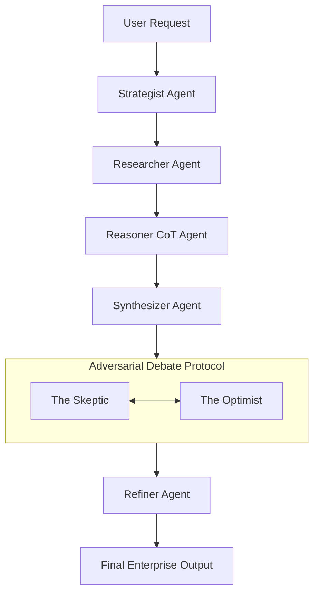

# 🌌 AuraCore AI Command Center — Enterprise Local Multi-Agent Orchestration

[]()
[]()
[]()
[]()
[]()

AuraCore AI is an enterprise-grade, local-first multi-agent orchestration and adversarial reasoning platform. It allows developers and enterprises to execute deep research, writing, and security auditing tasks using local LLMs (via Ollama)—guaranteeing **100% data sovereignty, zero API call latency, and no external data exposure.**

---

## 🧠 Neural Architecture: The 6-Agent Evolution Loop

AuraCore implements a recursive adversarial loop where agents stress-test outputs in multiple debate rounds to maximize logic depth and eliminate fallacies.



### The Pipeline Details:
1. **Strategist:** Deconstructs the request and drafts the optimal logical execution roadmap.
2. **Researcher:** Integrates local documents and scrapes live telemetry (via DuckDuckGo) for real-time validation.
3. **Reasoner (Chain-of-Thought):** Maps dependencies, logical premises, and hidden assumptions before drafting text.
4. **Synthesizer:** Merges research logs and logical proofs into a high-density intelligence briefing.
5. **Neural Debate Protocol:** Forces a bilateral debate between **The Skeptic** (audits logic, flags security risks/generic advice) and **The Optimist** (validates core insights and refines solutions).
6. **Refiner:** Polishes output formatting, syntax, and verifies against a quality threshold (7/10).

---

## 🛡️ Core Capabilities

*   **94% Reasoning Depth**: Recursive adversarial refinement loops ensure outputs exceed standard single-pass LLM prompts.
*   **Red Team Mode**: Automatically switches agents into security auditing. The Penetration Tester agent audits code/architecture vulnerabilities while the Security Architect drafts mitigation patches.
*   **Zero-Cloud Privacy**: Designed to protect IP. All inference is run locally on-device.
*   **Neural Portability**: Bridges and packages AI state configurations into transportable, encrypted `.aura` profiles.
*   **Multi-Model Selection**: Automatically selects and routes tasks to the best local model (e.g., `Llama3` for analysis, `DeepSeek-Coder` for engineering, `Mistral` for general reasoning).

---

## 🛠️ Installation & Setup (Docker / Local)

### Prerequisites
1.  **Docker Desktop** installed.
2.  **Ollama** installed and running on your local machine.
3.  Download your preferred models:
    ```bash
    ollama pull llama3
    ollama pull mistral
    ollama pull deepseek-coder
    ```

### Running with Docker (Recommended)
1.  Clone the repository:
    ```bash
    git clone https://github.com/kalyan-1845/AuraCore.git
    cd AuraCore
    ```
2.  Launch the stack:
    ```bash
    docker-compose up --build
    ```
3.  Open [http://localhost:3000](http://localhost:3000) in your browser.

### Manual Setup
#### Backend (FastAPI)
1.  Navigate to the backend directory and install Python dependencies:
    ```bash
    cd backend
    python -m venv venv
    source venv/bin/activate  # On Windows: venv\Scriptsctivate
    pip install -r requirements.txt
    ```
2.  Start the FastAPI application:
    ```bash
    uvicorn app.main:app --host 0.0.0.0 --port 8000
    ```

#### Frontend (Next.js)
1.  Navigate to the frontend directory and install Node dependencies:
    ```bash
    cd ../frontend
    npm install
    ```
2.  Start the development server:
    ```bash
    npm run dev
    ```
3.  The frontend is now available at [http://localhost:3000](http://localhost:3000).

---

## 📁 Repository Structure

```
AuraCore/
├── frontend/             # Next.js 15 application dashboard
│   ├── src/              # React components & Zustand state store
│   └── package.json
├── docker-compose.yml    # Docker container stack configuration
├── Dockerfile            # Frontend container build steps
├── Start_AuraCore.bat    # Windows launcher utility script
├── pyproject.toml        # Backend python dependencies packaging
└── README.md             # Project documentation
```