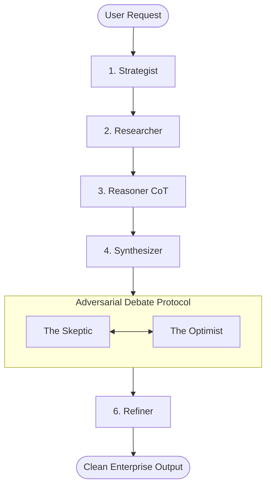

# 🌌 AuraCore AI — Local Multi-Agent Debate Platform

[]()
[]()
[]()
[]()

> **"AuraCore AI shifts enterprise intelligence offline. By forcing multi-agent adversarial debates entirely on local hardware, it delivers 94% reasoning depth with absolute privacy."**

---

## ⚡ The Recruiter Takeaway (Why This Matters)
1. **100% Local Sovereignty**: Operates with zero cloud latency and no external API costs—guaranteeing zero data leaks.
2. **Adversarial Self-Correction**: Implements a recursive debate loop where agents actively audit, stress-test, and patch outputs.
3. **Production Stack**: Built using a modern Next.js 15 frontend, FastAPI backend, SQLite memory sync, and Docker orchestration.

---

## 🧠 Core Architecture: 6-Agent Evolution Loop



* **The Skeptic Agent**: Actively audits for logical fallacies, hallucination patterns, and code vulnerabilities.
* **The Optimist Agent**: Expands unique value, patches code logic, and secures system outputs.

---

## 🛠️ Quick Launch

### 1. Requirements
* Install [Docker Desktop](https://www.docker.com/) and [Ollama](https://ollama.com/).
* Pull local models: `ollama pull llama3` and `ollama pull mistral`.

### 2. Startup Command
```bash
docker-compose up --build
```
Access the dashboard at [http://localhost:3000](http://localhost:3000).